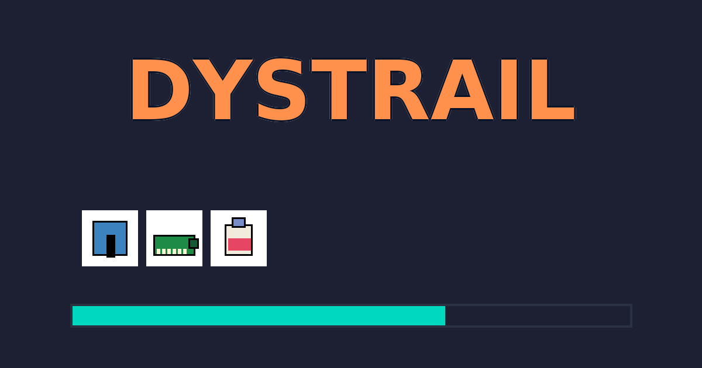

# 🎮 Dystrail

*What if Oregon Trail took a wrong turn and ended up in DC?*

**Dystrail** is a SNES-lite parody survival game where you march toward Capitol Hill, dodging tariffs, raw milk stands, brain worms, and the dreaded **National Pants Emergency**.



## 🕹️ Gameplay Loop
1. **Boot & Loading** → asset preloading with progress bar, *Press Any Key to Begin*.
2. **Persona Selection** → choose your character (Journalist, Organizer, Whistleblower, Lobbyist, Staffer, Satirist) with unique stats and abilities.
3. **Outfitting Store** → purchase supplies and gear before departure.
4. **Share Code & Mode** → prefilled seed (e.g., `CL-ORANGE42`), paste a friend/streamer's code to replay their run.
5. **Mode Select** → **Classic** or **The Deep End** (edgier encounters).
6. **Travel System** → manage pace and diet while burning supplies; weather affects progress.
7. **Camp Management** → rest, resupply, and recover between legs.
8. **Encounters** → multi-choice cards with stat effects (Raw Milk, Tariffs, Brain Worms, 5G towers, etc.).
9. **Executive Orders** → rotating global debuffs affecting gameplay.
10. **Vehicle Management** → maintain and upgrade your transportation.
11. **Filibuster Boss** → multi-phase final challenge.
12. **Result Screen** → detailed ending with stats and **shareable seed**.

## ✨ Features
- **SNES-lite 16-bit style** palette and sprites.
- **Six unique personas** with distinct starting stats and gameplay modifiers.
- **Comprehensive survival mechanics**: supplies, sanity, credibility, morale, allies, budget.
- **Dynamic weather and pacing systems** affecting travel and resource consumption.
- **Vehicle management** with maintenance and upgrade systems.
- **Camp system** for rest and resupply between travel legs.
- **Outfitting store** for gear and supply management.
- **Save system** with multiple save slots and import/export functionality.
- **Modes**: `CL` (Classic) and `DP` (The Deep End) with different encounter pools.
- **Share Codes**: `CL-WORD42` / `DP-ORANGE97` — short, memorable, deterministic seeds.
- **Pants Meter**: reach 💩 100% → **National Pants Emergency** fail state.
- **Internationalization**: Support for 11 languages (EN, ES, FR, IT, PT, DE, RU, AR, ZH, HI, BN, JA).
- **Data-driven content**: all encounters, personas, and systems configurable via JSON.
- **Accessibility**: WCAG AA compliance, keyboard navigation, high-contrast & reduced-motion toggles.
- **Responsive design**: works on desktop and mobile with touch-friendly controls.
- **Meta tags**: clean social media unfurls on Discord, Slack, X/Twitter, Facebook.

## 📦 Assets & Data
- `static/img/palette.png` — locked SNES-lite color palette
- `static/img/spritesheet.png` — game sprites and tiles
- `static/img/logo.png` — DYSTRAIL wordmark
- `static/img/social-card.png` — 1200×630 Open Graph/Twitter card
- `static/favicon.ico` — pants sprite favicon
- `static/assets/data/` — game configuration files:
  - `game.json` — encounters and choices
  - `personas.json` — character classes and stats
  - `pacing.json` — travel pace configurations
  - `vehicle.json` — vehicle types and upgrades
  - `weather.json` — weather system data
  - `camp.json` — camping and rest mechanics
  - `store.json` — shop items and prices
- `i18n/` — internationalization files for 11 languages

## 🛠 Dev Setup
**Prerequisites:**
```bash
# Install Rust and required targets
rustup target add wasm32-unknown-unknown
cargo install trunk
```

**Development:**
```bash
# Clone and run dev server
git clone https://github.com/VannaDii/Dystrail.git
cd Dystrail
trunk serve --open
```

**Building:**
```bash
# Production build
trunk build --release
```

**Testing:**
```bash
# Run WASM tests
wasm-pack test --headless --firefox
cargo test
```

## ➕ Contributing

### Adding Encounters
Edit `static/assets/data/game.json`:
```json
{
  "id": "tariff_whiplash",
  "name": "Tariff Whiplash",
  "desc": "A surprise tariff now applies to... your stuff.",
  "weight": 5,
  "regions": ["RustBelt","Beltway"],
  "modes": ["classic","deep_end"],
  "choices": [
    {
      "label": "Pay the tariff",
      "effects": {
        "supplies": -2,
        "credibility": 1,
        "pants": 5,
        "log": "You pay the tariff. It stings."
      }
    }
  ]
}
```

### Adding Personas
Edit `static/assets/data/personas.json`:
```json
{
  "my_persona": {
    "name": "My Persona",
    "desc": "A custom character with unique abilities.",
    "score_mult": 1.0,
    "start": { "supplies":18, "credibility":6, "sanity":10, "morale":5, "allies":1, "budget":110 },
    "mods": { "receipt_find_pct": 5 }
  }
}
```

### Internationalization
Add translations to `i18n/{language}.json` files. Use `en.json` as the reference template.

### Code Style
- Use Rust 2024 edition conventions
- Follow Yew functional component patterns
- Keep components small and focused
- Use proper TypeScript-style prop interfaces

## 🏗️ Architecture

**Frontend:** Rust + Yew (React-like) → WebAssembly
**Deployment:** Static hosting (GitHub Pages, Netlify, Vercel)
**State Management:** Yew hooks (`use_state`, `use_reducer`) + LocalStorage
**Routing:** Yew Router for SPA navigation
**Styling:** CSS with retro/pixel-art aesthetic
**Assets:** Static files served from `/static/`
**Data:** JSON configuration files loaded at runtime
**I18n:** Runtime language switching with fallback to English

**Key Modules:**
- `src/app.rs` — main application and routing logic
- `src/components/ui/` — all UI components (menus, panels, dialogs)
- `src/game/` — game logic (state, encounters, personas, systems)
- `src/i18n.rs` — internationalization management
- `tests/wasm/` — WebAssembly test suite

## 🚀 Roadmap

### Phase 1 (Current)
- ✅ Core game mechanics and survival systems
- ✅ Persona system with 6 unique characters
- ✅ Comprehensive UI with accessibility features
- ✅ Internationalization (11 languages)
- ✅ Save/load system with multiple slots
- ✅ Data-driven encounter and configuration system

### Phase 2 (Planned)
- 🔊 **Audio System:** encounter chimes, success/fail stings, filibuster fanfare
- 🎨 **Enhanced Visuals:** animated sprites, particle effects, dynamic backgrounds
- 📊 **Analytics:** gameplay metrics and balance insights
- 🎮 **Gamepad Support:** controller input for accessibility
- 🌐 **PWA Features:** offline play, app installation

### Phase 3 (Future)
- 🏆 **Achievement System:** unlockable goals and rewards
- 📱 **Mobile App:** native iOS/Android versions
- 🔗 **Social Features:** leaderboards, shared challenge modes
- 🎯 **Mod Support:** community-created content and encounters
- 🎪 **Seasonal Events:** time-limited content and themes

## 📜 License
MIT

## 👥 Credits
**Team Dystrail** — design, development, pixel art, and political satire
**Community Contributors** — encounter ideas, translations, and feedback
**Special Thanks** — to everyone who helped test and improve the game

Community contributions welcome! See the Contributing section above for how to help.