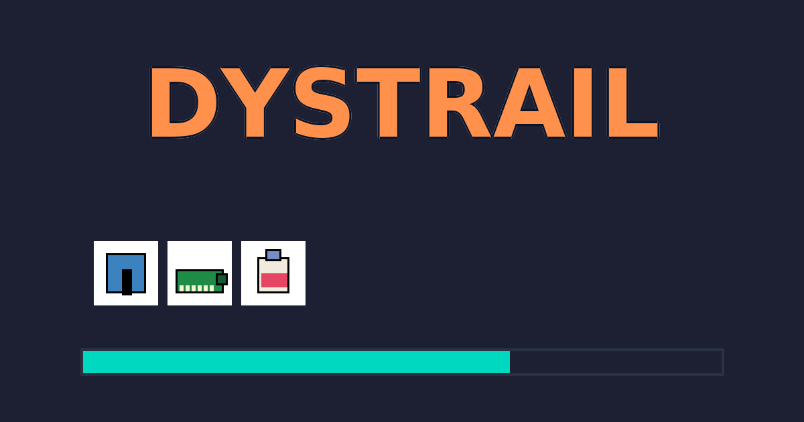

# 🎮 Dystrail

_What if Oregon Trail took a wrong turn and ended up in D.C.?_

**Dystrail** is a SNES-lite parody survival game where you march toward Capitol Hill, dodging tariffs, raw milk stands, brain worms, and the dreaded **National Pants Emergency**.



## 🕹️ Gameplay Loop

1. **Boot & Loading** → asset preloading with progress bar, _Press Any Key to Begin_.
2. **Persona Selection** → choose your character (Journalist, Organizer, Whistleblower, Lobbyist, Staffer, Satirist) with unique stats and abilities.
3. **Outfitting Store** → purchase supplies and gear before departure.
4. **Share Code & Mode** → prefilled seed (e.g., `CL-ORANGE42`), paste a friend/streamer's code to replay their run.
5. **Mode Select** → **Classic** or **The Deep End** (edgier encounters).
6. **Travel System** → manage pace and diet while burning supplies; weather affects progress and breakdown chances.
7. **Camp Management** → rest, resupply, and recover between legs.
8. **Encounters** → multi-choice cards with stat effects (Raw Milk, Tariffs, Brain Worms, 5G towers, etc.).
9. **Executive Orders** → rotating global debuffs affecting gameplay.
10. **Vehicle Breakdowns** → random failures requiring spare parts or repair time.
11. **Border Crossings** → navigate checkpoints with permits, bribes, or alternative routes.
12. **Filibuster Boss** → multi-phase final challenge.
13. **Result Screen** → comprehensive ending analysis with deterministic scoring, detailed statistics breakdown, shareable text generation, and replay functionality via **OT-style keyboard navigation** (1-9/0 keys).

## ✨ Features

- **SNES-lite 16-bit style** palette and sprites.
- **Six unique personas** with distinct starting stats and gameplay modifiers.
- **Comprehensive survival mechanics**: supplies, sanity, credibility, morale, allies, budget.
- **Dynamic weather and pacing systems** affecting travel and resource consumption.
- **Vehicle breakdown system** with realistic maintenance and repair mechanics.
- **Camp system** for rest and resupply between travel legs.
- **Border crossings** with permit, bribe, or detour options.
- **Outfitting store** for gear and supply management.
- **Save system** with multiple save slots and import/export functionality.
- **Modes**: `CL` (Classic) and `DP` (The Deep End) with different encounter pools.
- **Share Codes**: `CL-WORD42` / `DP-ORANGE97` — short, memorable, deterministic seeds.
- **Pants Meter**: reach 💩 100% → **National Pants Emergency** fail state.
- **Internationalization**: Support for 20 languages (EN, ES, FR, IT, PT, DE, RU, AR, ZH, HI, BN, JA, KO, ID, TR, TA, TE, MR, PA, JV).
- **Data-driven content**: all encounters, personas, and systems configurable via JSON.
- **Result System**: deterministic scoring with configurable weights, comprehensive statistics tracking, and social sharing capabilities.
- **Accessibility**: WCAG AA compliance, keyboard navigation, high-contrast & reduced-motion toggles.
- **Responsive design**: works on desktop and mobile with touch-friendly controls.
- **Meta tags**: clean social media unfurls on Discord, Slack, X/Twitter, Facebook.

## 📦 Assets & Data

- `dystrail-web/static/img/palette.png` — locked SNES-lite color palette
- `dystrail-web/static/img/spritesheet.png` — game sprites and tiles
- `dystrail-web/static/img/logo.png` — DYSTRAIL wordmark
- `dystrail-web/static/img/social-card.png` — 1200×630 Open Graph/Twitter card
- `dystrail-web/static/favicon.ico` — pants sprite favicon
- `dystrail-web/static/assets/data/` — game configuration files:
  - `game.json` — encounters and choices
  - `personas.json` — character classes and stats
  - `pacing.json` — travel pace configurations
  - `vehicle.json` — vehicle types and upgrades
  - `weather.json` — weather system data
  - `camp.json` — camping and rest mechanics
  - `store.json` — shop items and prices
  - `crossings.json` — border crossing configurations
  - `result.json` — result screen configuration and scoring parameters
- `dystrail-web/i18n/` — internationalization files for 20 languages

## 🛠 Dev Setup

**Prerequisites (workspace root):**

```bash
# Toolchain
rustup target add wasm32-unknown-unknown
cargo install trunk wasm-pack cargo-tarpaulin cargo-deny cargo-audit just
```

**Development & Validation (run from repo root):**

```bash
# Live-reload web UI
just serve-web

# Full lint/test sweep (fmt + clippy + workspace tests + wasm-pack + coverage)
just lint

# Faster sanity checks
just tests

# Security/license checks
just security

# Release artifacts (Trunk + workspace release builds)
just build-release

# Full pre-merge pipeline
just validate
```

## ➕ Contributing

### Adding Encounters

Edit `dystrail-web/static/assets/data/game.json`:

```json
{
  "id": "tariff_whiplash",
  "name": "Tariff Whiplash",
  "desc": "A surprise tariff now applies to... your stuff.",
  "weight": 5,
  "regions": ["RustBelt", "Beltway"],
  "modes": ["classic", "deep_end"],
  "choices": [
    {
      "label": "Pay the tariff",
      "effects": {
        "supplies": -2,
        "credibility": 1,
        "pants": 5,
        "log": "You pay the tariff. It stings."
      }
    }
  ]
}
```

### Adding Personas

Edit `dystrail-web/static/assets/data/personas.json`:

```json
{
  "my_persona": {
    "name": "My Persona",
    "desc": "A custom character with unique abilities.",
    "score_mult": 1.0,
    "start": { "supplies": 18, "credibility": 6, "sanity": 10, "morale": 5, "allies": 1, "budget": 110 },
    "mods": { "receipt_find_pct": 5 }
  }
}
```

### Internationalization

Add translations to `dystrail-web/i18n/{language}.json` files. Use `en.json` as the reference template.

### Code Style

- Use Rust 2024 edition conventions
- Follow Yew functional component patterns
- Keep components small and focused
- Use proper TypeScript-style prop interfaces

## 🏗️ Architecture

**Workspace Structure:**

- `dystrail-game/` — Platform-agnostic core game engine (Rust library)
- `dystrail-web/` — Web frontend using Yew (WebAssembly)
- `dystrail-tester/` — Automated testing and scenario validation tools
- `Justfile` — canonical dev scripts for fmt/lint/tests/security/build

**Frontend:** Rust + Yew (React-like) → WebAssembly **Deployment:** Static hosting (GitHub Pages, Netlify, Vercel) **State Management:** Yew hooks (`use_state`, `use_reducer`) + LocalStorage **Routing:** Yew Router for SPA navigation **Styling:** CSS with retro/pixel-art aesthetic **Assets:** Static files served from `dystrail-web/static/` **Data:** JSON configuration files loaded at runtime **I18n:** Runtime language switching with fallback to English

**Core Game Engine (`dystrail-game/`):**

- `src/state.rs` — core game state and turn progression logic
- `src/encounters.rs` — encounter system and selection algorithms
- `src/personas.rs` — character classes and abilities
- `src/vehicle.rs` — vehicle breakdown and maintenance systems
- `src/weather.rs` — weather effects and seasonal changes
- `src/pacing.rs` — pace and diet configuration
- `src/camp.rs` — rest and resupply mechanics
- `src/crossings.rs` — border crossing challenges
- `src/result.rs` — deterministic scoring and ending analysis

**Web Frontend (`dystrail-web/`):**

- `src/lib.rs` — WASM entrypoint; renders `app::App` and bootstraps a11y/i18n
- `src/app/` — app state machine, routing glue, and top-level view composition
- `src/router.rs` & `src/pages/` — typed routes + page modules (boot, persona, outfitting, menu, travel, camp, encounter, boss, result, 404)
- `src/components/` — shared shell components (header, footer, buttons, modal)
- `src/components/ui/` — feature modules (travel panel, pace/diet panel, camp panel, vehicle status, main menu, save drawer, settings dialog, result screen, crossing card, outfitting store, etc.)
- `src/i18n/` — bundle, formatting, locale metadata, rendering helpers
- `src/a11y.rs` — focus management, high-contrast toggle, aria utilities
- `static/` — assets (images, favicon, JSON data)
- `i18n/*.json` — translations for 20 locales
- `tests/` — wasm-bindgen tests (headless browser)

## 🚀 Roadmap

### Phase 1 (Current)

- ✅ Core game mechanics and survival systems
- ✅ Persona system with 6 unique characters
- ✅ Comprehensive UI with accessibility features
- ✅ Internationalization (20 languages)
- ✅ Save/load system with multiple slots
- ✅ Data-driven encounter and configuration system
- ✅ Result screen with deterministic scoring and social sharing

### Phase 2 (Planned)

- 🔊 **Audio System:** encounter chimes, success/fail stings, filibuster fanfare
- 🎨 **Enhanced Visuals:** animated sprites, particle effects, dynamic backgrounds
- 📊 **Analytics:** gameplay metrics and balance insights
- 🎮 **Gamepad Support:** controller input for accessibility
- 🌐 **PWA Features:** offline play, app installation

### Phase 3 (Future)

- 🏆 **Achievement System:** unlockable goals and rewards
- 📱 **Mobile App:** native iOS/Android versions
- 🔗 **Social Features:** leaderboards, shared challenge modes
- 🎯 **Mod Support:** community-created content and encounters
- 🎪 **Seasonal Events:** time-limited content and themes

## 📜 License

MIT

## 👥 Credits

**Team Dystrail** — design, development, pixel art, and political satire **Community Contributors** — encounter ideas, translations, and feedback **Special Thanks** — to everyone who helped test and improve the game

Community contributions welcome! See the Contributing section above for how to help.
