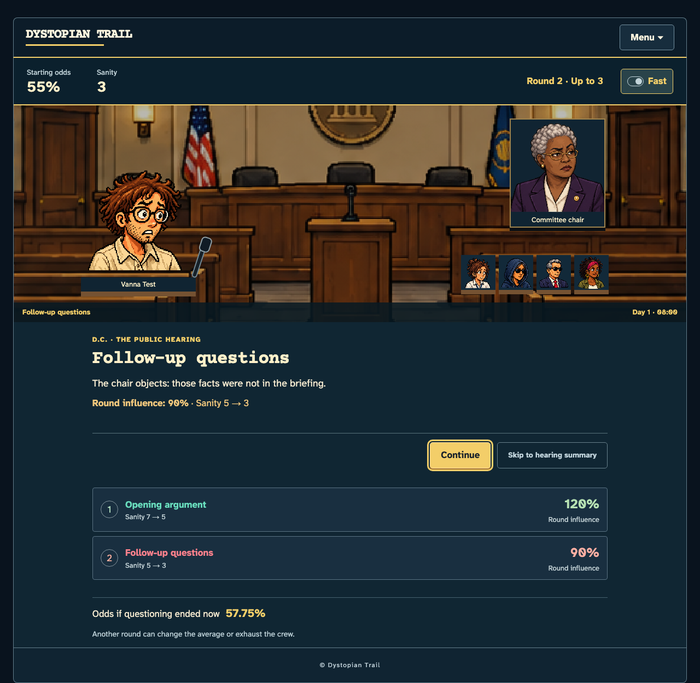

**Staged hearing: implemented review**

**Latest revision:** [September 14 playtest feedback](feedback-2026-09-14/README.md) implements held arrival, named portrait frames, narrative preparation, round stat cards, persistent closing announcements, readable operators, and twelve ending expressions. The current preview is revision `d085be895d332cd717a9`; 54 desktop/mobile browser checks pass. [Replay from the road checkpoint](http://127.0.0.1:62524/play/before-hearing-review.html).

The approved hearing is implemented and validated in the existing Rust/Yew game, ready for release review. The instant outcome button now opens an arrival, preparation, questioning, committee and verdict sequence. The local release build is ready to try. This change has not been published.

[Open the playable hearing review](http://127.0.0.1:62523/play/hearing-review.html). This loads a test crew at arrival in a separate local preview origin. Choose **Begin hearing** to use the real resolver. The preview bootstrap is outside the shipped game. If the local server is stopped, the [review save](hearing-review-save.json) can be loaded through Menu → Saves → Restore from file in a build containing this change.

For the road-to-hearing transition, restore [before-hearing-save.json](before-hearing-save.json) through Menu → Save / Load → Restore from file, then click **Travel** once. This test save has all pending crossings cleared, 10 sanity, and an unattempted hearing. File restore, reload and exactly one travel turn into Arrival were verified.

The implemented rules retain the existing stat-derived starting odds. Each of one to three actual rounds costs 2 sanity and rolls 50–150% influence. Independent 50% checks decide whether questioning continues. Only completed rounds enter the average. Exhaustion ends the hearing immediately. Surviving questioning with adjusted odds of at least 100% secures victory; otherwise the original final-draw convention decides it. The existing Deep/Aggressive guarantee survives weak influence if the crew finishes questioning.

The result is committed once and its reveal position is saved separately. Fast mode, Skip, reload, manual save/load and rapid clicks do not reroll or charge additional costs. An old completed save remains completed. The two-hour hearing duration still uses the existing day/ledger accounting, but it no longer triggers recovery or hazards after the verdict.

**Initial implementation (superseded presentation screenshots)**

The current crew appears in the existing D.C. setting, with time-of-day light, a new chair/clerk reaction atlas and three satirical exchanges. Each round holds for reading and shows its influence and sanity cost. Committee checks advance automatically. Controls remain reachable without covering history. The four endings distinguish a passed vote, failed vote, secured victory and exhaustion. The latest revision replaces the original mechanical explanations with narrative and shared stat cards; its screenshots are linked above.

[Phone layout](screenshots/hearing-round-2-mobile.png) · [Secured victory](screenshots/hearing-ending-secured-mobile.png) · [Exhaustion](screenshots/hearing-ending-exhausted-mobile.png) · [Arabic layout](screenshots/hearing-ar-mobile.png)

New hearing text follows the existing translation coverage: English, Italian, Spanish and Arabic, with English fallback in the other locale bundles. New art is included in the offline build. Animation changes pacing and presentation; it does not introduce tactical choices or timing challenges.

**Original model verification and accepted balance**

378 native tests, 2 WebAssembly browser tests and 26 release-build browser checks pass. Native and WebAssembly pedantic lint, formatting, whitespace and all 122 offline asset hashes/lengths pass. The supplied game skill client exercised preparation and a keyboard-driven secured verdict on the final build without runtime errors; earlier iterations also exercised a closed hearing and final vote. Desktop and phone screenshots were inspected. The final release revision is `9f4c685e4e9207ccf7d7`.

The 8,000-run campaign comparison uses 1,000 runs per mode/strategy and the same seeds for the committed old implementation and this change:

| Scenario | Old hearing | Staged hearing | Interpretation |
|---|---:|---:|---|
| Classic/Balanced arrival rate | 34.6% | 34.6% | Journey reach is unchanged. |
| Classic/Balanced win rate, all runs | 20.7% | 19.7% | 197 wins meet the user-approved minimum of 190 per 1,000 runs. |
| Deep/Aggressive arrival and win rate | 99.2% | 99.2% | The existing guaranteed approval remains intact. |

The user explicitly accepted 190–200 wins per 1,000 runs. The Classic/Balanced minimum is now 19%; its existing 35% ceiling and all other limits remain unchanged. A boundary check rejects 189 and accepts 190, 197, 200 and 201 wins. The full 8,000-run campaign command passes with this accepted minimum. Existing nonfatal strategy warnings remain visible in the log.

These are observed results for the tested seeds, not universal win probabilities. The new questioning stream is independent of the original final-vote stream; its domain is fixed as `hearing-v1`. No seed selection or probability tuning was applied. An [exact conditional probability audit](audit/probability-audit.json) of the 346 recorded arrivals predicts 193.76 wins under the old hearing and 192.09 under the staged model. That calculation conditions on these arrival states; it is not a forecast for every possible journey.

[Preparation cost](screenshots/hearing-policy-preparation.png) · [Prepared crew verdict](screenshots/hearing-policy-verdict.png) · [Exact draw boundary on phone](screenshots/hearing-draw-boundary-mobile.png)

[Requirement audit](completion-audit.md) · [Machine-readable validation](validation.json) · [Final campaign log](checks/campaign.log) · [Old-model comparison](checks/baseline-campaign.log) · [Asset provenance](asset-provenance.json) · [Approved storyboard](../../hearing-storyboard.md)
