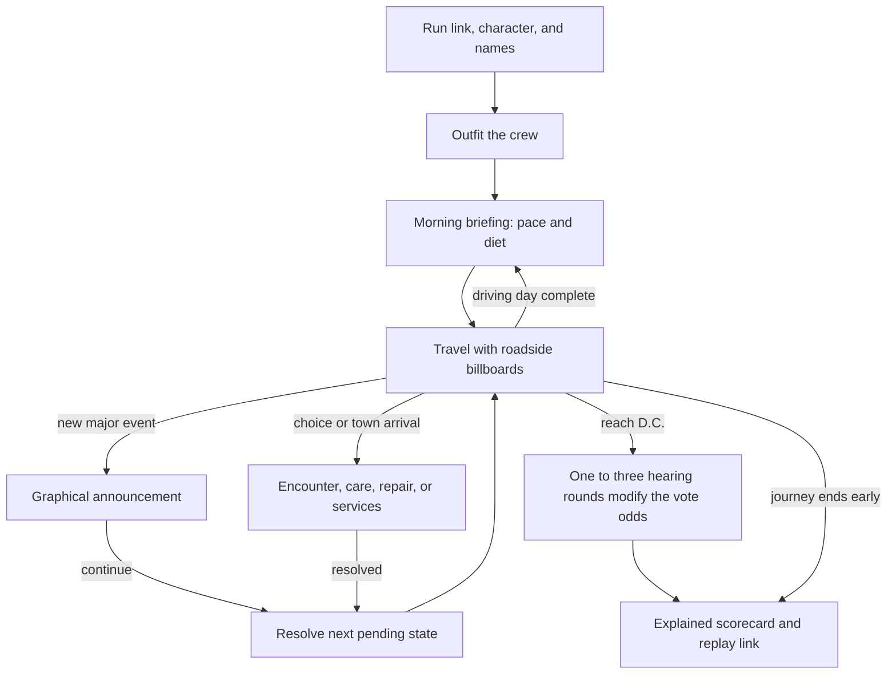

**Dystrail: enhancement review and implementation plan**

Implementation update, September 13: the approved hearing is now built locally. See the [implemented review and accepted campaign balance](implementation/hearing/README.md). The material below records the design review that preceded implementation.

Prepared September 13, 2026; updated to retain stat-influenced randomness and model the user's conditional hearing rounds. Status: proposal for review. This document evaluates 14 ideas and the staged hearing proposal; it does not implement game changes.

September 14 feature extraction: [Visual world and satire integration](/Users/vanna/Source/Dystrail/docs/ux/enhancement-review-2026-09-13/features/art-and-satire/feature.md) now owns the cast, seating, scene art, time-of-day lighting, billboards, compatible satire variants, and their presentation/localization/save support. It includes ideas 1, 8, 13, 14 and the relevant presentation work from 2 and 10. Its pinned content-release baseline and 644-record coverage inventory supersede this review's earlier content inventory for that feature. Hearing mechanics and the other gameplay enhancements retain their separate scope.

The review uses the supplied screenshots, the current checkout at `9622e73a4f8fa250097efde226ac22dcc645b206`, and a short local browser walkthrough from setup through an encounter. The [screen evidence and limitations](/Users/vanna/Source/Dystrail/docs/ux/enhancement-review-2026-09-13/screens.md) distinguish observed behavior, source findings, and proposals. Existing staged work and content briefs were left intact. No full campaign, mobile accessibility audit, or production verification was performed for this planning task.

Taken together, the ideas move the game toward a journey with recognizable days, memorable interruptions, a more deliberate cast, and a suspenseful ending that shows the influence of preparation. Decisions would rely more on understanding consequences; exact results would still explain what happened afterward. Protective equipment and the staged hearing are the largest simulation changes. Daily checkpoints, scene lighting, shared-run identity, and honest score comparisons depend on those rules.

All 14 ideas fit that direction, with the following accommodations. The user has chosen to retain the current stat-based starting odds and randomness. The deterministic-victory recommendation is withdrawn. The proposed hearing now modifies those odds through one to three randomly determined rounds, with a sanity cost for each actual round.

| Idea | Current implementation and experience | Proposed change and what must move with it |
|---|---|---|
| **1. Satirical billboards** | Travel uses separate landscape, van/crew, foreground, light, and weather layers. Road sections repeat and alternate mirrored artwork. | Add a separate roadside sign layer with localized ad text. Keep text out of mirrored landscapes, maintain readable size on phones, and avoid covering the crew or status bar. Choose signs deterministically without consuming gameplay randomness. Coordinate frequency with event announcements. |
| **2. Qualitative option subtitles** | Encounter choices format numerical effects, including capped gains; the same values appear in tooltips and accessible descriptions. Care, activities, repairs, pace/diet, and shop grants have other numerical presentation paths. There are **65 encounter families and 187 choices** in the current data. | Apply one vocabulary across decision surfaces: direction, resource used, uncertainty, serious consequences, and duration. Retain precise money offers/prices, actual quantities, current inventory, and completed results. Review option titles and help for unintended forecast leakage. Update localization and tests together. |
| **3. Remember crew/player names** | Names survive recovery within the current run. Fresh crew/player fields can be blank, but there is no separate last-used name preference in the inspected setup path. Companion names are generated separately. | Persist two explicit preferences and apply them only to fresh setup, including when the selected player role changes. Existing saves and current edits take precedence. Store the names used when naming is confirmed; distinguish an absent preference from a deliberately empty field. |
| **4. Unexplained travel pauses** | The travel completion callback stops automatic travel whenever supplies, health, or sanity are at or below 2. This check repeats every travel step. Hiding the document also pauses travel. Normal speed has periodic automatic map previews. | Record an explicit pause reason. Warn when a condition first becomes critical, reaches zero, or materially worsens; allow an informed continuation without stopping every step for the unchanged condition. Keep deliberate pause, hidden-tab pause, and genuine decisions. Integrate map previews with the daily rhythm. |
| **5. Travel with no supplies** | Zero supplies does not disable Travel. At daily initialization, starvation has one grace day, then costs health and sanity; illness risk also rises. A one-use backstop can defer hunger collapse. | Keep movement possible while making hunger, danger, and available recovery actions visible. A hard stop could prevent reaching supplies and strand players. Revisit the grace/backstop explanation and the severity curve during the equipment balance pass. |
| **6. Scorecard win comparisons** | Stat cards already support subtitles, but the scorecard supplies empty strings. Score target and actual vote outcome are separate. Health, sanity, and morale are missing despite their relevance. | Explain base odds, actual round influence, adjusted odds, and outcome. A stat-change comparison must name its benchmark or hold this hearing's actual rolls fixed. Handle caps, no possible stat-only improvement, and exhaustion without inventing a final vote. |
| **7. Run code in URL** | A code decoder and mode prefixes already exist. Setup initializes with `CL-ORANGE42`; no URL code intake was found. Result share text includes a code and a generic play URL separately. | Parse a validated code before recovery/router initialization can overwrite it, prefill setup, and generate links that include it. Include the selected persona/route and a rules version in a richer replay link because characters start on different routes. Handle existing saves and invalid links explicitly. |
| **8. Character presentation/diversity** | Six roles appear through a persona atlas, individual occupant portraits, a standing-crew atlas, scene portraits, results, and shared result images. There is also a six-person town NPC atlas. | Establish six canonical crew designs with gender-neutral or feminine presentation and greater racial diversity, then update every active representation consistently. Review supporting people against the same direction. Keep role mechanics separate from appearance; use explicit writing decisions for pronouns. |
| **9. Coverage and PPE wear** | Inventory remembers protection as tags, not item quantities or condition. A single tag gives the full current benefit. Shop limits are masks 3, coats 2, ponchos 2. Masks currently halve new illness risk; gear also mitigates specific weather penalties. | Add quantity, usable condition, equipped/reserve counts, and saved wear. Calculate coverage from active travelers, capped at one item per person. Update checkout, resupply, inventory, weather explanations, logs, old-save behavior, and starter loadouts. Rebalance prices and lifespan together. |
| **10. Major event scenes** | Active executive orders have status-bar explanations and a short highlight, without a dedicated announcement phase. Encounters already have illustrated scenes. | Use a reusable announcement scene for a newly activated major event, preserving its actual impact in the existing status bar afterward. Acknowledge once, then resume the appropriate activity. Do not reapply effects when presenting or restoring the scene. |
| **11. Daily transition** | Travel advances in hour-sized actions within a configured **08:00–13:00 driving window**, then the day rolls forward. Pace and information diet lock when daily initialization occurs. The next automatic action can consume the available editing opportunity. | Add one morning planning checkpoint per day, reached through a brief end-of-driving-day transition. Show the new day, condition summary, pace, and information diet before their effects are committed. Handle activities that cross the boundary as well as driving. |
| **12. Conditional hearing rounds** | The engine deducts sanity through three fixed rounds, then compares a random roll with stat-influenced odds capped at 88% except for a Deep/Aggressive policy override. The button resolves everything immediately. | Keep the starting-odds calculation. Always roll round 1, then roll whether rounds 2 and 3 occur. Charge 2 sanity per actual round, average only those round results as a multiplier, and resolve after the hearing closes: exhaustion fails; adjusted odds at least 100% win automatically; otherwise make the final vote draw. |
| **13. Van seating** | Six portraits are positioned as three pairs. Near/far images overlap substantially within each window. Crew presence and replacement-driver behavior already exist. | Design the van interior, seat boundaries, and seated poses together with the cast. Preserve identifiable seating, absence state, and a visible driver. Validate every remaining-crew combination and the smallest travel view. |
| **14. Time-of-day scenes** | World scenes receive the game-clock hour. Existing CSS adds a morning tint, dusk gradient, and night darkening; 10:00–16:00 is the same daylight band. Ordinary driving currently occurs from 08:00–13:00. | Develop a readable lighting system for moving and stopped roadside scenes, coordinated with weather and daily transitions. Design sky/ambient color, directional light, ground shadows, and local lights together; keep HUD text readable. Use the simulation clock and preserve the represented time through pauses, reports, and reloads. |

The most important shared decisions are below. These are recommendations, not settled rules.

**Travel should have a clear reason whenever it stops.** A morning checkpoint is a useful planned interruption because it offers an actual decision. A major announcement is a brief narrative interruption. Care, encounters, breakdowns, and town visits require action. Persistent low stats need a continuing warning, not another stop on every tick. Combine simultaneous notices where possible, and put terminal outcomes and unresolved choices ahead of cosmetic scenes.

I recommend one morning checkpoint, not separate mandatory evening and morning confirmations. Carry yesterday's pace and diet forward and offer one “Begin day” action. After an announcement, a single continuation should dispatch to the next pending decision or resume travel; it should not require another Travel click. Keep the manual pause and a clear explanation when returning from an inactive tab. Fast mode should shorten transitions without skipping decisions; reduced motion should remove movement without discarding information.

The current five-hour driving budget is a balance rule. Show an end to the driving day and a transition to the next morning without pretending that 13:00 is sunset. Extending the driving window to evening would alter distance per day, resource use, encounter exposure, and town frequency and should be evaluated separately. A day change caused by work, repair, care, shopping, or rest must reach the same planning boundary. Do not charge the next day's selected diet before the player can choose it, retroactively change time already spent, or award an unfinished activity twice.

**Scene lighting should make the clock visible in the world.** Extend the existing layer rather than creating a disconnected lighting clock. Proposed art profiles: early morning, midday, late afternoon, dusk, and night. Use smooth interpolation from game-clock minutes where appropriate, with deliberate cuts for an overnight transition. Pausing travel freezes the represented time; waiting at a menu must not gradually turn the scene into night.

Produce contact sheets of the same road in moving and stopped states at representative hours before approving the system. Review sky brightness and hue, light direction, road/ground shadows, the van and crew, and billboards together. A colored rectangle may be sufficient for some ambient changes, but painted daytime skies and shadows may need selective masks or limited alternate art. Keep vehicle lights, camp lamps, and illuminated signs on separate emissive layers where the scene calls for them. Weather should combine with the time profile without obscuring characters, warnings, or text. Interior scenes need a defined relationship to exterior light rather than receiving the full outdoor tint.

The actual driving schedule remains authoritative: routine travel will show morning through midday under the present 08:00–13:00 rule. Later stationary activity, camp scenes, and explicit time skips can show evening/night. Do not compress a sunset into 13:00 simply to demonstrate every profile. Capture the represented timestamp with daily/event reports so an afternoon event is not accidentally shown under the following morning's lighting after a rollover. This is a presentation change unless a longer driving day is separately selected.

This is the intended experience flow. Implementation needs an ordered, persisted queue so announcements, overnight transitions, and decisions cannot hide or bypass one another. The queue presents committed events; it does not generate a second copy of their effects. Preserve the user's intent to pause when dispatching the next state.

**Qualitative choices should still be understandable.** Use the supplied care examples as the pattern: “Uses supplies, improves morale · 1 hour”; “Crew member leaves, morale declines · 1 hour”; “Costs sanity, illness may worsen · 1 hour.” State certain consequences plainly and use “may” only for genuine uncertainty. Critical care must still disclose the possibility of death. An unaffordable choice needs an explanation. A benefit already at its cap should not promise an increase.

Audit encounters, care, camp/foraging, town conversations and work, barter, repairs, any active crossing choices, pace/diet, and outfitting grant descriptions. Some newer encounter labels already describe an exact offer or a number of bundles; removing numerical subtitles alone will not make every choice less optimizable. Preserve quantities that define the actual action and review the rest deliberately. Change tooltips and screen-reader descriptions with visible text. Keep exact current stats, prices, purchase counts, elapsed time, and actual after-action/journal changes. This also allows the more informative final scorecard to teach players after a run.

**Empty supplies should create a survival problem the player can respond to.** For the classic Oregon Trail reference, its lead designer shows a live game with zero food and describes the party as starving, while his account of the travel design describes automatic movement with player pauses and major-event interruptions. This supports retaining zero-supply movement with consequences; it does not establish identical starvation timing across every edition. [Bouchard's zero-food comparison, Figure 17](https://www.philipbouchard.com/oregon-trail/different-journey.html), [the classic travel design](https://www.philipbouchard.com/oregon-trail/imagining-design.html).

Dystrail already models hunger. The proposed improvement is a clear first warning, a continuing hunger indicator, and relevant options such as gathering, food work, rest when appropriate, or the next shop. Rest alone must not be presented as a food source. Keep the game's combined Supplies abstraction for this pass; dividing food, water, and fuel into independent resources would be a separate redesign. The current “diet” setting is an information diet, not a food-ration setting.

**Equipment needs both a coverage model and an economy model.** For usable identical items, coverage is `min(usable items, active travelers) / active travelers`. Protection equals coverage multiplied by the item's maximum efficacy for the relevant hazard. If condition gradually reduces efficacy, aggregate each equipped item's remaining effectiveness instead of counting a worn item as new. An empty party must be handled as an ending before dividing by its size. Allies are a separate support-network statistic and must not increase the traveler denominator.

For coats, use a 100% maximum offset for the covered cold effects on travelers and no routine wear. Define that scope explicitly: protection from cold-related stat/exposure harm does not automatically make icy roads or the vehicle immune to weather. For a conservative first balance candidate, retain the current full-coverage benefits for the other items: masks can halve new illness risk and offset the existing smoke sanity penalty; ponchos can offset the existing storm sanity penalty. These are game rules, not real-world PPE efficacy claims. Broader mitigation and final lifespan values need a measured tuning decision.

Only equipment actually used should wear. Reserve stock stays fresh; wear follows simulated exposure/time rather than animation frames or clicks. A mask used against overlapping hazards should not lose its lifetime twice for the same interval. Choose and document when masks are worn for general illness protection and when ponchos are deployed for rain. Preserve fractional damage and wear across actions and saves so one coat among six has a real intermediate effect rather than rounding to either full protection or none. Remove expired gear from usable coverage and recompute protection tags from inventory.

Use a shared van inventory with automatic allocation to active travelers. Recompute coverage after departures; change item quantities only when a defined story or transaction removes equipment. Avoid adding six separate equipment-management screens. Show “2 of 6 covered,” usable/reserve counts, remaining condition, and concise replacement warnings in outfitting, resupply, and The Van. The weather status must distinguish partial protection from full mitigation and report actual costs after it.

At current list prices, six coats cost $60, six masks $36, and six ponchos $48: **$144 total**, versus $90–$130 starting budgets, before food or spares. Current quantity caps also prevent a full set in one purchase. Raise appropriate caps, then test affordable route-appropriate starting packages and replenishment through the existing town shop. Do not solve this by making every hazard easy or making all three full sets mandatory. Finalize unit prices, purchase packaging, lifespan, and starting loadouts together.

Legacy saves retain only protection tags, so past PPE quantities cannot reliably be recovered. Recommended compatibility policy: keep existing active runs on their original gear behavior; new runs use the new equipment rules. If a one-way migration is preferred instead, specify an explicit granted quantity/condition policy and explain it rather than pretending the old save recorded a count. Save/import/export, autosave, and replay links need the same rules identity.

**Keep stat-influenced randomness and make the hearing unfold in rounds.** The user has chosen to preserve the existing starting-odds calculation. The proposed sequence always includes round 1, then independent checks determine whether rounds 2 and 3 are called. Each actual performance roll costs 2 sanity. Continuation checks and the final vote cost no additional sanity. Zero sanity ends the hearing before any automatic victory or final vote.

The [staged hearing model](/Users/vanna/Source/Dystrail/docs/ux/enhancement-review-2026-09-13/hearing-model.md) supplies the exact candidate sequence, examples, arithmetic checks, presentation needs, and edge cases. The working baseline carried into the accepted implementation goal uses influence rolls of 50–150% with a neutral mean of 100%, plus 50% continuation chances after rounds 1 and 2. Rounds can help or hurt. These values still require campaign balance validation.

Average only the influence values for rounds that actually occurred. Multiply the original odds by that average divided by 100. A normal 0–100 roll used directly as a percentage multiplier would only weaken the starting odds; dividing by three when fewer rounds occur would add another arbitrary penalty. For example, a 55% base and a 120% average produce 66%; an 80% base and a 130% average produce 104%. Once the hearing has closed and sanity remains positive, 100% or more produces automatic victory; otherwise resolve the final random vote. A provisional value over 100% must not award victory while another round can still be called.

Keep the current stat/score formula, applicable base probability bounds, and policy preparation separate from the new hearing multiplier. Do not reapply the ordinary 88% cap after that multiplier, because doing so would prevent automatic wins. Explicitly preserve or separately change the existing Deep/Aggressive guaranteed-vote exception; the compatibility recommendation is to retain it for a surviving crew. The current display score target, raw vote score, and persona/mode multipliers are distinct and still need honest labeling. Declared but unused boss weight/pass settings should not be mistaken for active mechanics.

The new model changes balance even with neutral average influence. With 50/50 continuation, hearing lengths are 50% one round, 25% two, and 25% three. For a crew that can survive all three, the expected sanity cost falls from 6 to 3.5. Crews entering with 3–4 sanity can survive a one-round hearing; those with 5–6 can survive up to two. More rounds narrow the influence average toward neutral while increasing exhaustion risk. Clipping adjusted odds at 100% also slightly lowers expected results for strong base odds; under the candidate and the existing integer-percent final draw, an 88% base models at about 84.21% overall for a crew able to survive all lengths. These isolated arithmetic checks are not a campaign balance verdict.

Update the pre-hearing preview: it currently assumes all three sanity costs. Distinguish starting vote odds, exhaustion risk, provisional adjusted odds, and final odds. Use one shared model for resolution and any overall forecast. Otherwise the new sequence could make the displayed “chance of winning” inaccurate even while preserving the old base formula.

The [arrival-to-verdict storyboard](/Users/vanna/Source/Dystrail/docs/ux/enhancement-review-2026-09-13/hearing-storyboard.md) specifies the scenes, player actions, emotional progression, and four ending states. Give each round a staged reaction and visible sanity cost, followed by the committee calling another round or closing the hearing. Player-controlled reveals, automatic playback, skip, and reduced motion can add suspense and pacing control without a click for every continuation check. This does not by itself add tactical agency; resource/approach choices between rounds would be a separate optional design addition.

For the baseline without tactical choices, resolve and save a hearing report once, then reveal its stages. Record the original odds, actual round values, continuation results, per-round sanity, adjusted odds, any final vote draw, and outcome. Reuse the dedicated hearing random stream and version the rules, because the new draw sequence changes same-seed outcomes. Skip, reload, and double-clicks must not reroll, repay sanity, or reveal later stat deductions early.

The scorecard should explain the actual sequence. A retrospective “what would have won” stat comparison can hold this completed hearing's recorded rolls fixed and search for a valid change that would beat its final draw. It must be labeled as specific to this hearing, not as a guaranteed outcome in another run. Some rolls cannot be overcome by any allowed stat-only change within the base-odds cap. Exhaustion has no observed final vote to reconstruct; explain the sanity shortfall and do not invent future results. One coherent smallest-change example remains the proposed card interpretation; independent one-stat comparisons are an alternative requiring explicit labeling. Keep early journey deaths, historical counters, and display-score benchmarks distinct from final-vote counterfactuals.

**Run links must describe what “the same trail” means.** Recommended link shape: `/play/?code=CL-RUDY47&persona=staffer&rules=<supported-version>`. The code already carries Classic/Deep mode; the persona identifies the route/origin. A code-only link should still work by prefilling the supplied code and allowing normal character selection. Show that the run came from a link. Never put crew/player names in the URL.

Resolve link intake before autosave restoration. When a different active run exists, preserve it and offer a clear choice to continue it or begin the linked trail; do not silently overwrite it. Validate format, mode, persona, duplicate/empty parameters, and unsupported versions. Invalid values need recoverable setup feedback rather than silent substitution. Consume the incoming intent once so phase navigation and reload do not keep restarting the run. Update “Copy run link,” result sharing, and replay setup together.

The same code does not imply synchronized multiplayer or identical outcomes after different decisions. Strong reproducibility requires the same rules, starting setup, and actions. Keep billboard/art selection outside the simulation RNG. The existing proposed content brief also suggests cross-run novelty history; that must not silently change a shared challenge. Use deterministic content selection for linked replays, or record a replay manifest if exact history-dependent content becomes part of the promise.

**Cast and seating should be commissioned together.** Retain the blue van, pixel-art language, readable roles, and independent crew-presence system. Decide the visual identity of every crew member before producing selection, travel, standing, hearing, and result variants. Use racial diversity across the cast without assigning mechanical strengths or weaknesses by race. Explicitly define presentation and pronoun handling; do not infer these from a player's name.

The seating reference calls for more than moving a face a few pixels. Establish the camera angle, six physical seat positions, separate head/shoulder silhouettes, seatbacks/window boundaries, and a driver with a natural driving pose. Produce near/far seated poses where needed instead of placing identical busts over one another. Validate all six present, missing near/far partners, a replacement driver, and a single remaining traveler. Use real alpha transparency for new cutouts. One in-app capture showed colored matte blocks around the existing standing art that are absent from the user's Safari reference; treat that as a cross-browser rendering check, not a confirmed universal defect.

The following is the proposed content and design budget. Counts labeled “proposed” are production targets for this enhancement pass, not claims about content already written or a commitment to expand unrelated content.

| Package | Deliverables needed | Reuse and dependencies |
|---|---|---|
| **Billboards** | Proposed first set: 12 short ads, two associated with each of six regions; two reusable sign structures; desktop/mobile placement and legibility layouts. Each record needs ID, mode/region eligibility, short text, and any factual source hook. | Reuse road settings. Keep localized text separate from sign art. Rotation must not mirror lettering or consume simulation RNG. No new encounter branches are required. |
| **Qualitative decisions** | Review all 187 current encounter choices; a shared consequence vocabulary; separate care, town, work, camp, trade, repair, pace/diet, and shop templates; capped, uncertain, unaffordable, and critical variants. | Preserve existing jokes and mechanics unless explicitly changed. Coordinate with the current satire/content brief rather than rewriting or commissioning duplicates. |
| **Major announcements** | One reusable scene layout; six executive-order illustration/copy packages covering activation, actual effect, and relief; severity rules for weather and other events. | Reuse appropriate encounter settings. The current content brief already proposes 18 bulletin text variants, but its order names differ from the active engine enum. Reconcile stable IDs/effects before writing or illustration. Minor ongoing effects remain in the HUD/journal. |
| **Daily briefing** | One interaction layout with end-of-driving-day and morning states; compact day summary, pace/diet controls, hunger/PPE notices, Begin day action, and stationary/overnight variants. | Reuse regional camp settings and lighting. Do not commission a separate full background for every possible combination of weather and day. |
| **Time-of-day lighting** | Proposed five lighting profiles: early morning, midday, late afternoon, dusk, night; moving/stopped comparison sheets; sky/ambient and shadow masks where needed; limited headlight/lamp/sign-light layers. | Extend existing scene-light behavior. Check all regions and weather types, indoor attenuation, displayed time, and report/overnight continuity. Do not require a unique full scene image for every combination. |
| **Crew and van** | Six character sheets; proposed 24 core views: six selection portraits, six standing poses, and twelve near/far seated poses; one revised van/interior composition. Audit the six town NPC portraits and other active depictions. | Lock seating geometry before exporting the poses. Reuse approved portraits for care, conversations, hearing, results, and share images. Refresh screenshots used on the homepage when released. |
| **PPE interface** | Three equipment detail treatments; coverage, reserve, worn, expired, and replacement states; shop/van/weather layouts; honest maxima and use descriptions. | Existing item icons can be reused. Final text depends on approved efficacy, lifespan, pricing, and migration rules. |
| **Hearing** | Three round contexts with weak/neutral/strong reactions, two continuation-or-close announcements, sanity/influence/odds readouts, and exhaustion/automatic-victory/final-vote-win/final-vote-loss states; skip and reduced-motion equivalents. | Settle influence range and continuation chances before final copy/animation. Reuse the civic setting, cast, and existing hearing/ending brief. Base-odds text must not be mislabeled as overall win probability. |
| **Scorecard and replay** | Stat-card actual/benchmark examples; base-to-adjusted odds breakdown; cap/unreachable/no-fixed-target/exhaustion/early-ending states; comparisons conditional on this hearing's actual rolls; linked-run and name-preference states. | Reuse StatCard and sharing surfaces. These depend on the hearing report, benchmark interpretation, and replay contract. |

There are 20 registered locale files. The existing narrative brief prioritizes English, Spanish, Italian, and Arabic. Decide release coverage explicitly: utility/mechanical strings must remain correct for every offered locale, and new satire needs reviewed translations for the committed languages with a deliberate fallback for the remainder. Validate interpolation, text expansion, and Arabic layout. Billboards need text that remains readable without being baked into an image. Keep jokes witty, sharp, short, and causally clear; distinguish fictional announcements from sourced real-world claims.

I recommend implementing in the following order. Parallel work is possible after the shared contracts and dimensions are settled, but each slice should have one reviewable result.

| Phase | Work and dependencies | Exit criteria |
|---|---|---|
| **0. Agree the behavior and design contracts** | Review the conditional hearing model: influence distribution, continuation chances, cost timing, existing policy exception, and pacing versus tactical choices. Review morning cadence, lighting, low-stat warnings, scorecard interpretation, PPE scope/compatibility, and linked-run identity. Produce wireframes and lighting/seating studies; record campaign baseline metrics. | A specified hearing formula with measured balance assumptions, approved interaction states, and a finite art/content checklist. Every interruption has a reason and a defined continuation. |
| **1. Establish rules, persistence, and replay foundations** | Preserve the current base-odds formula; define a shared staged-hearing calculation and report for resolution, forecasts, and results. Version rules and timestamped presentation reports. Add last-used name preferences, URL intake and link generation; preserve active saves. | Engine and UI use the same model. Reports preserve actual rounds, continuation results, sanity, and any final draw. Fresh setup, navigation, reload, import, replay, invalid links, and existing-run conflicts behave consistently. Presentation cannot reroll or repay actions. |
| **2. Implement equipment and survival support** | Add counted PPE, per-person coverage, condition/use, fractional accounting, old-run compatibility, and authoritative protection readouts. Extend existing shop/resupply, starter packages, and inventory receipts. Add hunger explanations. | One versus six coats has the requested proportional effect; reserves do not wear; exhausted PPE ceases protection; all six routes have viable equipment/food tradeoffs. |
| **3. Implement travel rhythm and decision copy** | Use the phase/report foundation for morning planning, explicit pause reasons, one-time critical warnings, major-event announcements, and coordinated map/choice dispatch. Apply qualitative subtitles across all decision paths and locales. | A routine step needs no manual resume; one planned morning decision occurs per day; no pending decision is skipped; displayed costs and actual outcomes stay consistent. |
| **4. Integrate art and roadside content** | Use the approved cast/seating design; update portraits, standing/seated variants, NPCs as required, and shared images. Integrate clock-driven lighting profiles, billboard layout/selection, and major-event art. | Readable billboards, distinct seating, no absent crew, consistent identities, moving/stopped scenes matching the displayed time, correct weather combinations, and usable mobile/Arabic layouts. |
| **5. Implement hearing rounds, presentation, and explained results** | Resolve the approved one-to-three-round model from preserved base odds; reveal performance, sanity, continuation, and closing results from its saved report. Add forecasts, conditional stat comparisons, missing result stats, and linked replay controls. | Only actual rounds cost sanity; only their performance enters the average; a closed surviving hearing at 100% or more skips the final draw. Skip/reload cannot alter outcomes. Guidance, verdict, and scorecard agree; impossible and early-ending cases remain honest. |
| **6. Validate the combined experience and prepare release** | Run focused engine/browser checks, then a bounded campaign comparison across modes/personas/policies. Review full runs for reading burden, unplanned clicks, hunger pressure, PPE replacement frequency, and finale length. Update offline assets and release notes. | Measured balance and usability acceptance, reliable saves/replay/offline updates, completed content/art QA, and a concrete release candidate for deployment approval. |

Hearing probability/stamina tuning, PPE, and the combined playability pass carry the most uncertainty. URL/name work is comparatively small. The travel rhythm and hearing/scorecard work are medium-to-large because they cross saved state and presentation. Cast/seating and lighting are coordinated art production tasks. Calendar estimates should follow the approved asset quantity and measured balance baseline rather than treating these as 14 equally sized tickets.

Validation should target the behavior that can regress:

| Area | Required checks |
|---|---|
| **Continuous travel and daily gates** | Normal/Fast/reduced-motion modes; healthy routine travel; unchanged critical condition; newly empty supplies; manual pause; inactive tab; map preview; simultaneous incident/day boundary; work/care/repair crossing a boundary; overnight reload. Count forced clicks by reason. |
| **Equipment and economy** | 0/1/5/6/7 items with six travelers; fewer active travelers and no-active-crew ending; reserve versus worn units; overlapping hazards; fractional loss across saves; duplicate checkout; resupply; old saves; party departure; exact protection reported by HUD and journal. Compare equipment spending with food, repairs, route access, and failure mix. |
| **Choices** | Every current choice has matching visible/tooltip/accessibility semantics; affordability and capped gains; critical death risk; monetary offers; all supported language paths; correct actual outcomes. Avoid tests that merely mirror a phrase formatter. |
| **Hearing and results** | One/two/three rounds; entry sanity 2/3/4/5/6/7; average only actual performances; continuation checks cost nothing; adjusted odds below/at/above 100%; no early automatic victory; no final draw after automatic victory; existing policy exception; base-odds monotonicity; accurate overall forecasts; integer draw precision; impossible stat-only comparison; exhaustion without an invented final roll; skip/reload/double-click; old-version results. |
| **Links and names** | Code-only and full replay link; Classic/Deep prefix; same code with different characters/routes; same starting setup/actions; unsupported rules; malformed/repeated parameters; current saved run; cleared fields; switched character; storage unavailable; offline launch. |
| **Visual/accessibility** | Phone/desktop, zoom/text enlargement, keyboard and focus return, screen-reader announcement order, long translations/Arabic, reduced motion, sign contrast and reading time, six-seat silhouette/absence cases, true transparency across browsers, and shared-result image consistency. Compare lighting across representative hours, all regions/weather, moving/stopped states, indoor scenes, pause/reload, and overnight reports; verify HUD contrast and that real-world waiting does not change game time. |
| **Release** | Native engine tests and relevant existing browser suites; bounded campaign regression comparison; newly required offline files and cache update; recovery during update; production build routes and generated replay links. Preserve any already-failing baseline guards rather than weakening them to pass. |

The current campaign retune notes still report unmet experience guards. Treat that as a known baseline requiring fresh measurement in implementation, not as evidence that the new plan has been balanced already. Automated policies see internal state, so they cannot by themselves establish that qualitative choices are understandable or fun; include observed playthroughs.

The source map below is intended to keep implementation grounded and reviewable.

| Concern | Current source |
|---|---|
| Repeated low-stat stop | [Travel completion](/Users/vanna/Source/Dystrail/dystrail-web/src/app/turn.rs:29), [automatic flow and visibility](/Users/vanna/Source/Dystrail/dystrail-web/src/app/flow.rs:31), [automatic map](/Users/vanna/Source/Dystrail/dystrail-web/src/app/map.rs:7) |
| Day boundary and settings | [Driving window](/Users/vanna/Source/Dystrail/dystrail-game/src/travel_time.rs:4), [daily initialization](/Users/vanna/Source/Dystrail/dystrail-game/src/state.rs:3271), [day finalization](/Users/vanna/Source/Dystrail/dystrail-game/src/state.rs:3469), [stationary clock](/Users/vanna/Source/Dystrail/dystrail-game/src/journal.rs:117), [settings controls](/Users/vanna/Source/Dystrail/dystrail-web/src/components/ui/travel_panel/pace.rs:8) |
| Time-of-day lighting | [Clock supplied to the world scene](/Users/vanna/Source/Dystrail/dystrail-web/src/components/ui/world_view.rs:44), [hour-to-light bands](/Users/vanna/Source/Dystrail/dystrail-web/src/components/ui/journey_scene/mod.rs:104), [existing light overlays](/Users/vanna/Source/Dystrail/dystrail-web/static/journey.css:70) |
| Hunger and protection | [Starvation](/Users/vanna/Source/Dystrail/dystrail-game/src/state.rs:3872), [inventory shape](/Users/vanna/Source/Dystrail/dystrail-game/src/state.rs:2743), [weather mitigation/exposure](/Users/vanna/Source/Dystrail/dystrail-game/src/weather.rs:409), [store catalog](/Users/vanna/Source/Dystrail/dystrail-web/static/assets/data/store.json), [town resupply](/Users/vanna/Source/Dystrail/dystrail-web/src/app/services.rs) |
| Qualitative decisions | [Encounter effect previews](/Users/vanna/Source/Dystrail/dystrail-web/src/components/ui/encounter_card.rs:18), [ActionButton](/Users/vanna/Source/Dystrail/dystrail-web/src/components/ui/action_button.rs), [care actions](/Users/vanna/Source/Dystrail/dystrail-web/src/app/crew_care.rs), [current encounter bank](/Users/vanna/Source/Dystrail/dystrail-web/static/assets/data/game.json) |
| Names and replay | [Crew naming](/Users/vanna/Source/Dystrail/dystrail-web/src/app/view/phases/crew.rs), [party initialization](/Users/vanna/Source/Dystrail/dystrail-game/src/party.rs:55), [initial code](/Users/vanna/Source/Dystrail/dystrail-web/src/app/state.rs:64), [recovery](/Users/vanna/Source/Dystrail/dystrail-web/src/app/recovery.rs), [share text](/Users/vanna/Source/Dystrail/dystrail-web/src/components/ui/result_screen/post.rs) |
| Event presentation | [Active executive-order definitions](/Users/vanna/Source/Dystrail/dystrail-game/src/exec_orders.rs), [order lifecycle](/Users/vanna/Source/Dystrail/dystrail-game/src/state.rs:3320), [HUD effect readout](/Users/vanna/Source/Dystrail/dystrail-web/src/components/ui/stats_bar/policy.rs), [notification highlight](/Users/vanna/Source/Dystrail/dystrail-web/src/app/weather_status.rs) |
| Art and seating | [Scene layers](/Users/vanna/Source/Dystrail/dystrail-web/src/components/ui/journey_scene/mod.rs:95), [van seats](/Users/vanna/Source/Dystrail/dystrail-web/src/components/ui/journey_scene/van.rs), [standing cast](/Users/vanna/Source/Dystrail/dystrail-web/src/components/ui/journey_scene/parked.rs), [overlap rules](/Users/vanna/Source/Dystrail/dystrail-web/static/journey.css:118) |
| Finale and comparisons | [Actual hearing resolution](/Users/vanna/Source/Dystrail/dystrail-game/src/boss.rs:100), [vote probability](/Users/vanna/Source/Dystrail/dystrail-game/src/boss.rs:132), [score weights](/Users/vanna/Source/Dystrail/dystrail-game/src/state.rs:3844), [result calculation](/Users/vanna/Source/Dystrail/dystrail-game/src/result.rs:130), [blank stat subtitles](/Users/vanna/Source/Dystrail/dystrail-web/src/components/ui/result_screen/layout.rs:88) |
| Existing production briefs | [Content requirements](/Users/vanna/Source/Dystrail/docs/content-requirements.md), [content deliverable ledger](/Users/vanna/Source/Dystrail/docs/content-hit-list.md), [locale registry](/Users/vanna/Source/Dystrail/dystrail-web/src/i18n/locales.rs), [campaign baseline notes](/Users/vanna/Source/Dystrail/docs/ux/review-2026-09-11/implementation/campaign/retune-2026-09-13/README.md) |

The next step is to review the shared behavior contracts and wireframe brief in Phase 0, then authorize the first implementation slice.
