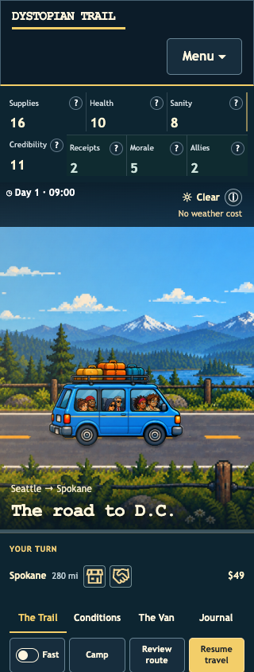
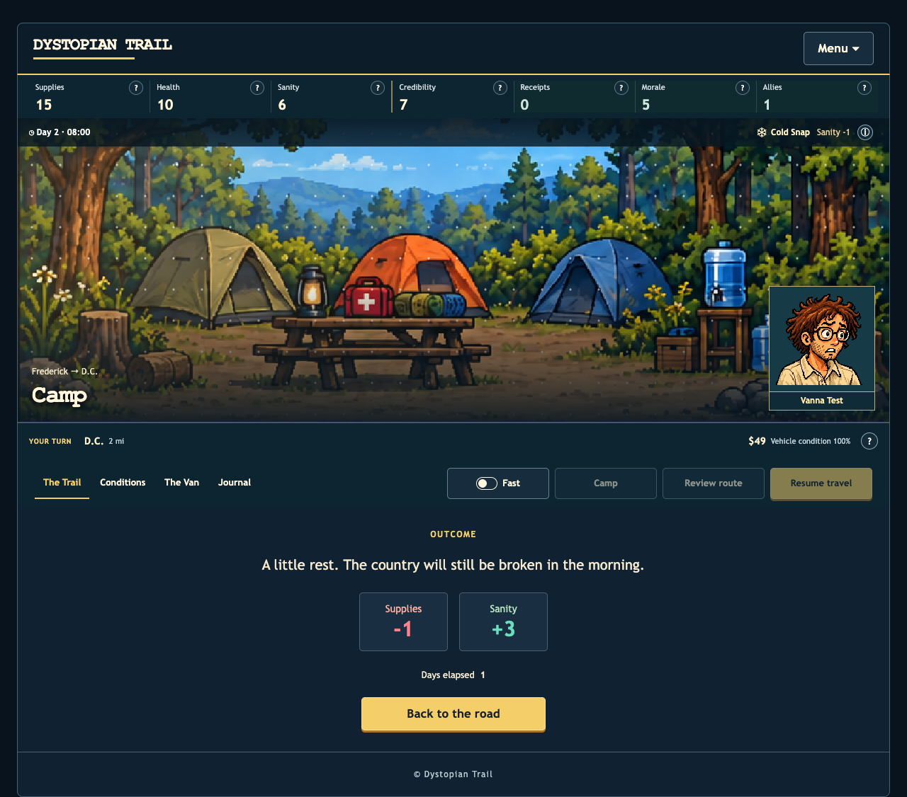
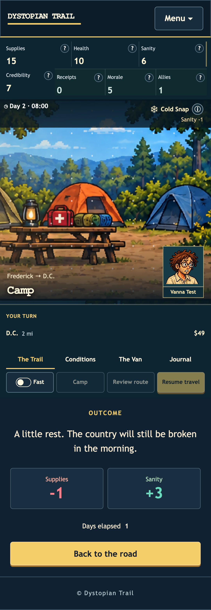

# Campaign continuity and tester fidelity

September 11, 2026. [Play the current preview](http://127.0.0.1:8180/play/) · [Feedback ledger](../feedback.md) · [Receipts](../receipts/README.md) · [Validation data](validation.json) · [Raw campaign CSV](campaign.csv).

## Corrected behavior

A late-route pacing rule could turn a stationary camp day into travel. Two miles before the destination, resting could therefore complete the route and open the hearing. A failing regression reproduced that behavior before the fix. Explicit stationary rest and full-day foraging now bypass both pacing conversions, spend the day in place, and leave arrival to the next actual travel action.

Named interactive repairs now mark real repair days in the journey ledger, once per day. Failed or repeated selections do not add another repair. The special automatic endgame field-repair flag remains separate; it is not fabricated from a player's repair choice.

## Simulator corrections

- Starting supplies and spare parts are purchased from the selected character's actual budget. Removed hidden preparation grants and tester-only price surcharges.
- Purchases use the same character discounts, whole-dollar prices, supply capacity and available funds as the game.
- The selected character is assigned before naming the player, keeping the leader attached to the correct avatar.
- The simulator uses actual crew-care and named-part repair choices with their costs, followed by the real town and gathering actions.
- Action time and full camp days use the browser's clock rules. A fatal crew decision ends the run before any later shopping, gathering or travel.
- The deterministic replay digest was updated after the intentional mechanics/telemetry corrections; independent repeated-run equality still passes. No pacing, distance, survival or victory threshold changed.

## Verified

At the time of this campaign verification, build **a24e05514179da6c0b69** was served on port 8180. The [current preview and evidence](../polish/README.md) include later UI fixes. All **88 files / 90,545,722 bytes** match the offline manifest's byte lengths and SHA-256 values.

**259 native tests**, **two registered Chrome/wasm tests**, strict native and wasm Clippy, native/Trunk release builds, formatting and whitespace checks pass. Coverage is **78.72%**. Dependency versions did not change in this pass; the security verification and exact-version temporary exceptions are recorded in the [receipts report](../receipts/README.md).

Installed Chrome **152.0.7977.84** passes four browser regressions: early and late-route camping at desktop and phone widths, including actual costs, a stationary route, a pending hearing, and save/reload. Screenshots were inspected. The first new browser test used the wrong serialized field name (`boss.readiness.ready` instead of `boss.ready`); correcting the fixture produced a clean four-test exit. The failure log is retained.

The required unmodified game-client smoke loop completed with exit 0; its character-selection screenshot was inspected. The gameplay screenshots below come from the browser regressions and cover the camp fix itself.

A final Chrome reload on this build preserved **two earned receipts**, showed all **seven HUD stats**, and raised no application errors. The prior receipt-award/offline/localization checks are in the receipts report; the styles, images and encounter data are byte-identical between that build and this one. Browser preload warnings remain recorded, rather than counted as application errors.

**Safari follow-through completed.** Native Safari 26.6.2 subsequently passed 18 feedback checks, including stationary late-route camping, offline receipt awards and all cached-asset hashes. The latest build also passes six native layout/offline/update checks. See [current evidence](../polish/README.md); the earlier failed attempts remain recorded in the logs.

## Campaign findings

All **8,000 runs** completed: 1,000 consecutive seeds (1337–2336) for each of four strategies in each mode. The command still exits **1** at the unchanged pacing gate. First failure: Classic/Balanced seed **1370**, a victorious run with **125 travel days, 8 partial days and 17 stopped days**, for **88.7% travel against the required 90%**.

| Automated strategy | Mean days | Mean travel share | Reached D.C. | Won hearing |
| --- | ---: | ---: | ---: | ---: |
| Classic - Aggressive | 105.4 | 92.3% | 63.6% | 4.5% |
| Classic - Balanced | 119.5 | 94.1% | 68.4% | 42.3% |
| Classic - Conservative | 144.4 | 91.4% | 77.6% | 16.2% |
| Classic - Resource Manager | 130.1 | 92.3% | 94.7% | 37.2% |
| Deep - Aggressive | 108.3 | 92.8% | 74.8% | 24.5% |
| Deep - Balanced | 144.5 | 92.9% | 66.5% | 34.8% |
| Deep - Conservative | 141.5 | 91.8% | 80.4% | 17.9% |
| Deep - Resource Manager | 114.4 | 93.1% | 87.7% | 30.8% |

These are automated strategies, not measured human success rates. The current Classic/Balanced sample reaches D.C. in 68.4% of runs and wins 42.3%; the existing checks require reach of 30–50% and wins of 20–35%. Passing those old bands would require a difficulty change or a deliberate change to what the campaign gate measures. This report does not call the failing campaign a pass. See the [balance decision](balance-decision.md).

## Browser evidence

[Commands and runner notes](commands.md). No production deployment, branch, commit or PR was made.
