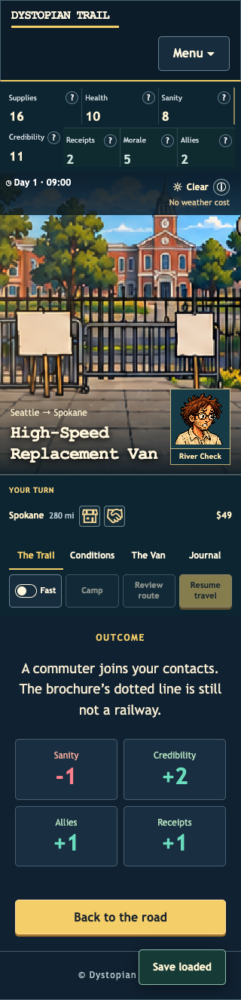
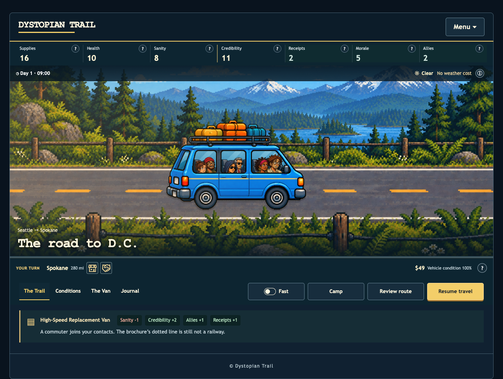

# Receipts, rewards and verification

September 11, 2026. [Play the local preview](http://127.0.0.1:8180/play/) · [Full inventory](../content/) · [Feedback ledger](../feedback.md) · [Validation data](validation.json).

## Player-facing change

Receipts were missing from the shared HUD, and none of the 65 shipped encounters awarded them. The HUD now includes **Receipts** beside Credibility on every gameplay screen. It stays one row on desktop and two compact rows on phones.

Twenty-six encounter choices now award evidence. Each eligible region and both modes have receipt opportunities. The button shows the guaranteed **Receipts +1** reward before selection; the outcome, The Trail and Journal show the actual change. Examples include publishing both versions of a grant announcement, documenting missing rail funding and preserving weather records. Existing costs and satire remain intact.

The previously unused character and news-diet bonuses now affect the displayed chance of finding one additional supporting record. The guaranteed receipt does not depend on that roll. The daily news bonus no longer accumulates indefinitely. Held receipts contribute eight points each to the journey score used at the hearing; contextual help explains earning, keeping and explicitly spending them.

The Trail's resource summary also now includes Cash, spare parts and vehicle condition, matching the outcome cards and Journal. A receipt-only outcome no longer incorrectly says that no resources changed.

The encounter source is `dystrail-web/static/assets/data/game.json`. The reward mapping lives in `scripts/encounter_evidence.py`; the western-encounter generator reapplies it, and the generated review inventory lists each reward.

## Verified

- Installed **Chrome 152.0.7977.84**: real encounter choices award the promised receipt once, update the shared count and outcome, persist after reload, and remain in The Trail and Journal. An offline reload, a second receipt award while disconnected, and another offline reload all passed. Browser console: no application errors.
- English, Spanish, Italian and Arabic: seven HUD values, one desktop row and two phone rows; no horizontal overflow at 1280, 390 or 320 CSS pixels. Final-build English help and Arabic at 320 px were checked after the browser-only lint cleanup.
- **254 native Rust tests** passed. **Two registered wasm-bindgen browser tests** passed in installed Chrome: the HUD updates without replacing its row, and the actual encounter button awards the offered receipt once.
- Strict Clippy passed for the full native workspace and separately for the web crate's wasm target, including test code. Formatting, native release and Trunk release passed. Engine coverage is **78.24%**, above the required 77%.
- The complete offline bundle has **88 files**. Every file served on port 8180 is verified against its manifest byte length and SHA-256.

The initial Rust browser run exposed a ChromeDriver 153 / Chrome 152 mismatch. Using the matching official driver fixed it. CI now installs a matched browser/driver pair. Benchmark output is directed to an existing directory. Older files under `tests/wasm/` remain unregistered and are not counted as passing tests.

The bundled game client also ran against the isolated preview using the project's Playwright dependency and installed Chrome; its character-selection screenshot was inspected. The receipt gameplay checks above used the persistent Chrome CLI session and game import controls with synthetic test players.

## Remaining work

**Superseding update:** [Campaign continuity and current evidence](../campaign/README.md) covers build `a24e05514179da6c0b69`, 259 native tests, corrected simulator fidelity, stationary late-route camping, and the latest 8,000-run dataset. The Safari and balance decisions remain open. The notes below describe the preceding receipt build.

**Current Safari receipt verification is pending.** The native Safari 26.6.2 test window at port 56854 remains hidden and is waiting for the user to bring it forward. The earlier West Coast/conversation build passed 11 Safari checks; that is not a claim that the new receipt changes passed Safari. No physical phone installation was performed.

The 1,000-iteration campaign still fails its unchanged acceptance gate: the first reported Classic/Balanced CL-ORANGE02 travel ratio is **89.8% against 90%**. Other policies also report travel and endgame failures. Its tester now visits real towns, uses the engine's timed gathering activities and avoids applying a day's pace effects twice. Remaining differences include automatic repair decisions and tester-only store price surcharges; those need reconciliation before using the campaign to justify balance changes. Acceptance thresholds were not reduced.

Dependency updates removed the seven vulnerability findings. Three upstream unmaintained-package warnings remain covered by exact-version temporary exceptions, local tracking issues and an enforced **October 11, 2026** expiry. Audit and cargo-deny pass with those exceptions; the warnings were not fixed. See [dependency maintenance](../../../../security/dependency-maintenance.md).

No production deployment, branch, commit or PR was made. The broader continuity goal remains open for Safari verification and campaign acceptance.

## Evidence

Detailed command and runner notes are in [commands.md](commands.md). Earlier visual evidence is preserved in [West Coast and conversation validation](../west-coast/README.md).
